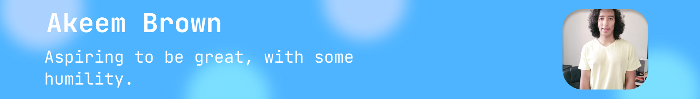

# Hey there, my name is Akeem 🤟

Hey there, how's it hanging? My name is Akeem Brown, but for formality, it's Mr. Brown. I am a novice-level front-end developer looking to improve my skills through experience and learn more about the world of computer programming. With my technical prowess in a handful of IDEs and languages, and some additional skills, I am confident in my ability in the digital industry... *sometimes*. However, my overconfidence does not come without merit, as I have taken the time to hone my skills with other institutions like CodeSpace and the University of Cape Town. If this has piqued your interest, take a further look at my profile.

## Education

 - ### University of Cape Town
From the UCP, I initiated a course in Data Science and Machine Learning with Python to get in touch with the ever-evolving world of **AI**.  Due to this, I thought it would be a useful skill to achieve, even if it were a small one.

- ### CodeSpace
CodeSpace, being my first professional, full-length programming school, not only taught me what it means to be an exceptional developer but also how to market myself as a highly sought-after developer.

## Work Experience

- ### Sea Cadets of T.S Springs
Though it may not count as a form of work in the sense of making money, I do believe it is something worth mentioning. The Sea Cadets are a group of aspiring adolescents who are seeking purpose, not for selfish reasons, but to help others. This includes not only fixing whatever problems they have but also making life easier for those in need, which encompasses the cadets themselves as well as individuals dealing with sickness, poverty, and a sense of being lost in the world.

## Langauges and Tools

    <a href="https://www.w3.org/html/" target="_blank" rel="noreferrer">   </a>     

## Extras

  

## Contacts
